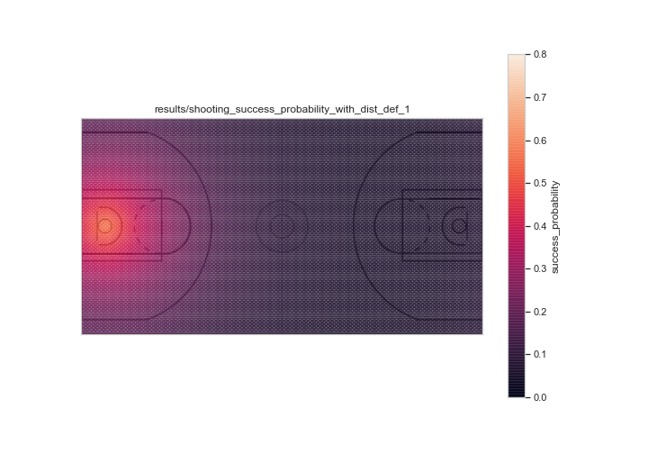
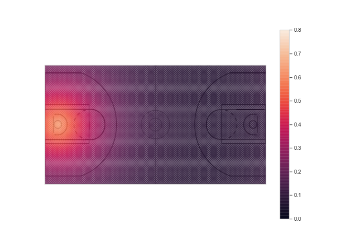
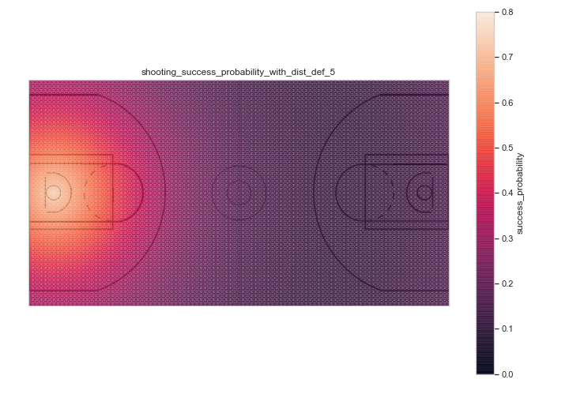

# NBA-games-visualisation-and-shooting-success-probability
This Sports Analytics project aims at creating a visualization tool for basketball games, incorporating the shooting success probability at any time.

## Project decomposition

This project has three main components:
- A Logistic Regression model - built in the `shot_success_probability.ipynb` file - which outputs, given the distances between the ball carrier, the defender that is closest to him and the basket, a shooting success probability. This model has been created using the `shot_logs.csv`file and can be found in the `/model` folder.
- The `data_transformation.ipynb` noteboook that takes the .json games files that contain the positions of the ball and of the ten players on the court, completes and transforms it to prepare it for the animtation.
- The `animation.py` file that displays the games' plays with the associated shooting success proability.

## Data

The `shot_logs.csv` file used to build the shooting success probability model can be found [on kaggle](https://www.kaggle.com/dansbecker/nba-shot-logs). It contains data on shots taken during the 2014-2015 season, who took the shot, where it was on the court, where was the closest defender, and more.  
The game data can be found on [this repository](https://github.com/linouk23/NBA-Player-Movements). It contains raw SportsVU game data from the 2016 season.

## Results

### Animation example


### Shooting success probabilities on the court

- Shooting success probability on the court with a closest defender 1 foot away from the ball carrier


- Shooting success probability on the court with a closest defender 2.5 feet away from the ball carrier


- Shooting success probability on the court with a closest defender 5 feet away from the ball carrier


## Organization of this directory
```
├── raw_data
│   ├── 0021500489.json
│   ├── 0021500492.json
│   ├── shot_logs.csv
│   └── court.png
├── python_code
│   ├── shot_success_probability.ipynb
│   ├── data_transformation.ipynb
│   └── animation.py
├── modified_data
│   └── gamedataset.csv
├── model
│   └── logit.pkl
├── results
│   ├── shooting_success_probability_with_dist_def_1.png
│   ├── shooting_success_probability_with_dist_def_2.5.png
│   ├── shooting_success_probability_with_dist_def_5.png
│   └── example.gif
└── README.md

1 directory, 8 files
```
